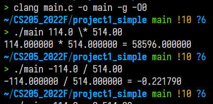
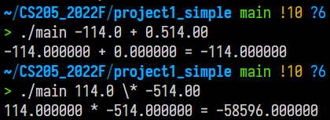

# Project 1 Report

Author: Qiu Kunyuan [11913019@mail.sustech.edu.cn](mailto://11913019@mail.sustech.edu.cn)

## Program Design

The program includes a input parser and a evaluator. To cover both the integer and double data types, the operands are stored in a `Number` struct:

```c
typedef struct
{
  int    integer;
  double double_number;
  char   flag_double;
} Number;
```

where the `flag_double` indicates whether the operand is `double` typed.

### Input Parser

Since the implementation of regex in C lacks the capture group ability and some important operators, the input parser is a simple word scanner. This scanner is capable of

- skip the leading zeroes
- read the sign of the input
- tell if double or int according to the decimal dot
- restrict the digits to avoid most overflow

The following part of the parser reads the sign of the input.

``` c
  if ((*input_str == '-')) {
    flag_negative_int = 1;
    input_str++;
  }
  else if (*input_str == '+') {
    flag_negative_int = 0;
    input_str++;
  }
  ...
  if (number_output->flag_double == 1) {
    number_output->double_number = atof(integer_str) * (flag_negative_int ? -1 : 1);
  }
  else {
    number_output->integer = atoi(integer_str) * (flag_negative_int ? -1 : 1);
  }
```

The following part restricts the digits to avoid integer overflow.

```c
  while (('0' <= *input_str) && (*input_str <= '9')) {
    if (idx_int > LONG_DIGIT) {
      break;
    }
    integer_str[idx_int] = (int)(*input_str);
    input_str++;
    idx_int++;
  }
  if (*input_str == '.') {
    number_output->flag_double = 1;
    idx_int++;
    integer_str[idx_int] = '.';
    input_str++;
    while (('0' <= *input_str) && (*input_str <= '9')) {
      if (idx_int > LONG_DIGIT * 4) {
        break;
      }
      integer_str[idx_int] = (int)(*input_str);
      input_str++;
      idx_int++;
    }
  }
```

Some of the initial discrimination against illegal inputs are located in the `main()` function:

- Illegal operators
- Illegal operands

```c
  if (((op1 != '-') && (op1 != '+')) && ((op1 < '0') || (op1 > '9'))) {
    printf("Oprand 1 is not a valid number.");
    return 0;
  }
  if ((op2 != '-') && (op2 != '+') && ((op2 < '0') || (op2 > '9'))) {
    printf("Oprand 2 is not a valid number.");
    return 0;
  }
  if (!((oprt1 == '+') || (oprt1 == '-') || (oprt1 == '*') || (oprt1 == '/'))) {
    printf("Invalid operator.");
    return 0;
  }
```

### Evaluator

To cover both the integer and the double type data, the evaluator casts `int` to `double` as long as one of its two operands is `double`. Otherwise, the return of the evaluator is `int`.

For the division evaluator, it aborts the execution when the divisor is zero.

```c
void number_OPERATION_(Number* num1, Number* num2, Number* res)
{
  res->flag_double = num1->flag_double || num2->flag_double;
  if (res->flag_double) {
    if (num1->flag_double) {
      if (num2->flag_double) {
        /* num2->double_number=0 ? abort() : continue; */
        res->double_number = num1->double_number __OPERATOR__ num2->double_number;
      }
      else {
        /* num2->double_number=0 ? abort() : continue; */
        res->double_number = num1->double_number __OPERATOR__ num2->integer;
      }
    }
    else if (num2->flag_double) {
      /* num2->double_number=0 ? abort() : continue; */
      if (num1->flag_double) {
        res->double_number = num1->double_number __OPERATOR__ num2->double_number;
      }
      else {

        res->double_number = num1->integer __OPERATOR__ num2->double_number;
      }
    }
  }
  else {
    /* num2->double_number=0 ? abort() : continue; */
    res->integer = num1->integer __OPERATOR__ num2->integer;
  }
}
```

## Test





Due to the principal flaw of the simple scanning input, the errornous 0.514.00 is recognised as 0.514