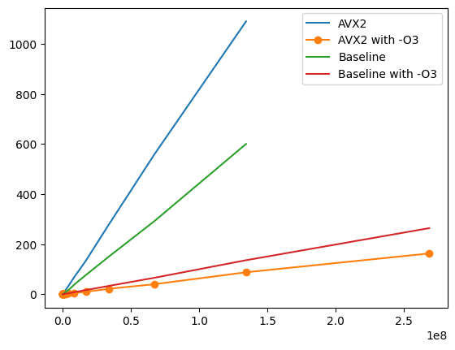

# Project 2 Report

Author: Qiu Kunyuan/仇琨元 [11913019@mail.sustech.edu.cn](mailto://11913019@mail.sustech.edu.cn)

## Implementation of matrix multiplication

The matrix multiplication is a $O(n)$ routine whether in the best case or in the worst case. The operation can be written in the following assembly code with separated ADD and MUL opcode,

```asm
loop:
LW $r4,0($r1)
LW $r5,0($r2)
ADDI $r1,$r1,4
ADDI $r2,$r2,4
MUL $r6,$r4,$r5
ADDI $r3,$r3,-1
ADD $r7,$r7,$r6
BGTZ $r3,loop
TEQ $r0,$r0
.data
array1: .word 1,2,3,4,5,6,7,8,9,10,11,12
array2: .word 1,2,3,4,5,6,7,8,9,10,11,12
```

or replace the `ADD` and `MUL` instruction with corresponding multiplication-add instruction on ISAs that supports mul-add operation like ARM with Neon FPU, x86-64 with SSE/AVX and TMS320 series DSP chip.

### Baseline method

```cpp
double dotProduct(myVector *v_1, myVector *v_2) {
    double result = 0;
    try {
        if (v_1->length != v_2->length) {
            throw std::out_of_range("Vector Length Mismatch");
        }
        int len = v_1->length;
        for (int i = 0; i < len; i++) {
            result += v_1->data[i] * v_2->data[i];
        }
        return result;
    } catch (const std::exception &e) {
        std::cout << e.what() << std::endl;
        return 0;
    }
}
```

### AVX2 Optimization

```cpp
double dotProduct_fast(myVector *v_1, myVector *v_2) {
    if (v_1->length != v_2->length) { // 检查长度是否一致
        throw std::invalid_argument("vector lengths do not match");
    }

    int     length = v_1->length;
    double *data_1 = v_1->data;
    double *data_2 = v_2->data;

    __m256d sum_vec = _mm256_setzero_pd(); // 初始化为0的256位寄存器

    for (int i = 0; i < length; i += 4) {
        // 从内存中加载4个双精度数到256位寄存器中
        __m256d vec_1 = _mm256_loadu_pd(&data_1[i]);
        __m256d vec_2 = _mm256_loadu_pd(&data_2[i]);
        // 生成掩码，将超出矢量长度的部分设为0
        __m256d mask = _mm256_cmp_pd(_mm256_set_pd(i + 3 > length, i + 2 > length, i + 1 > length, i > length), _mm256_setzero_pd(), _CMP_EQ_OQ);
        vec_1        = _mm256_and_pd(vec_1, mask);
        vec_2        = _mm256_and_pd(vec_2, mask);
        sum_vec      = _mm256_fmadd_pd(vec_1, vec_2, sum_vec);
        // 4个双精度数执行点乘并累加到256位寄存器中
    }

    double *sum_arr = (double *)&sum_vec;
    // 将256位寄存器中的双精度数转换为双精度数组
    double dot_product = sum_arr[0] + sum_arr[1] + sum_arr[2] + sum_arr[3];
    // 对双精度数组中的4个数求和得到点乘结果

    return dot_product;
}
```

## Benchmarking

The blue line represents AVX2 multiplication time versus the length of the vector, while the orange line is the baseline result.

